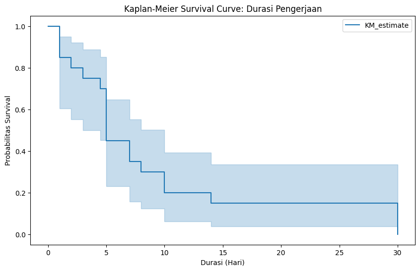
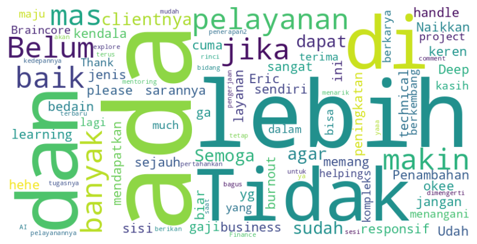
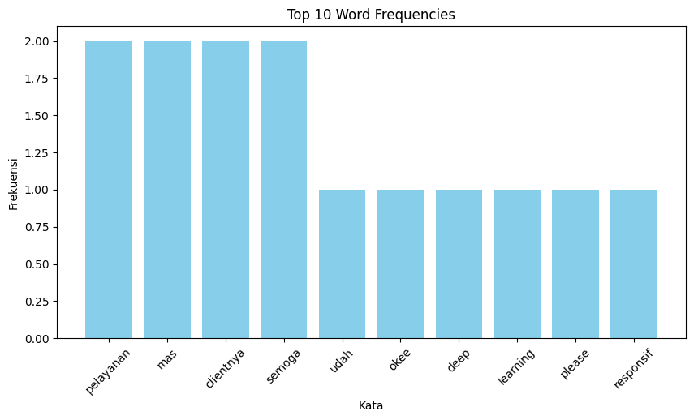

# Braincore’s Customer Satisfaction

## Dataset
This dataset contains information about the results of customer satisfaction assessments of Braincore services. The data includes the customer's name, profession, type of service used, duration of the project, speed of response and quality of communication, details of the project performed, price of the service, as well as suggestions for improving Braincore's services in the future.

## Data Understanding

The data set consists of 12 columns and 20 rows.
Source data: Braincore company feedback form
Data Dictionary:
- Timestamp: The time the feedback form was completed.
- Name: The customer's personal information.
- Occupation: The customer's occupation.
- Type of Service Used: The service purchased by the client.
- Work Duration (Days): The amount of time - - Braincore worked on the service.
- Service Satisfaction Level: The customer's level of satisfaction with the service.
- Speed of Response and Quality of Communication: - The customer's score for speed of response and quality of communication.
- Clarity of Projects Completed: Evaluation of the appropriateness of the project carried out.
- Speed of Delivery: The score related to the speed of service delivery.
- Price of Service: The fee paid by the client.
- Feedback: Suggestions and feedback from the customer for future improvement of Braincore's services.
- Recommendation: Whether the customer would recommend Braincore.

## Data Preparation

- Code used: Collab
- Packages: Pandas, Numpy, Matplotlib, Seaborn, WordCloud, and Counter

## Data Profiling
- Load the Data
- Check the Data
After checking the data, there is a column that has an inappropriate format, namely in the column Duration of work how many days (in numbers). Therefore, there is a need for a data transformation process

## Data Transformation
Data transformation is important for data analysis, there is a format difference in the column "Durasi pengerjaan berapa hari (dalam angka)", which should be in day format, but there is written in month format. This needs to be corrected by converting the data.
- Rezah Aurellia's customer data fills the "Durasi Pengerjaan berapa hari" column with a range of 5-7 days, which makes it difficult to analyze. So the value is adjusted by calculating the average, so it becomes 4 days.
- Pristia's customer data fills the “Durasi Pengerjaan berapa hari” column in 1 month format, which should use the day format. The value is converted to 30 days.

## Exploratory Data Analysis and Data Insight

From this chart, we can observe the distribution of service completion durations by Braincore. The majority of services are completed within a relatively short period of time, as the probability of survival decreases significantly during the first few days.

From the data, it can be illustrated that the most frequently occurring words, such as“ada”, “lebih”, “tidak”, “pelayanan” have larger visualizations. This makes it easier to quickly identify the key words contained in the feedback from user ratings.

From the data, it can be illustrated that frequently occurring words, such as  “ada”, “lebih”, “tidak”, “pelayanan” each have a frequency of occurrence of two times. Thus, the main words in the suggestions or feedback from user ratings can be easily seen.
